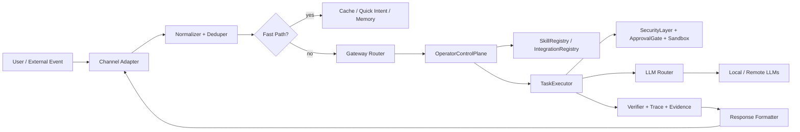
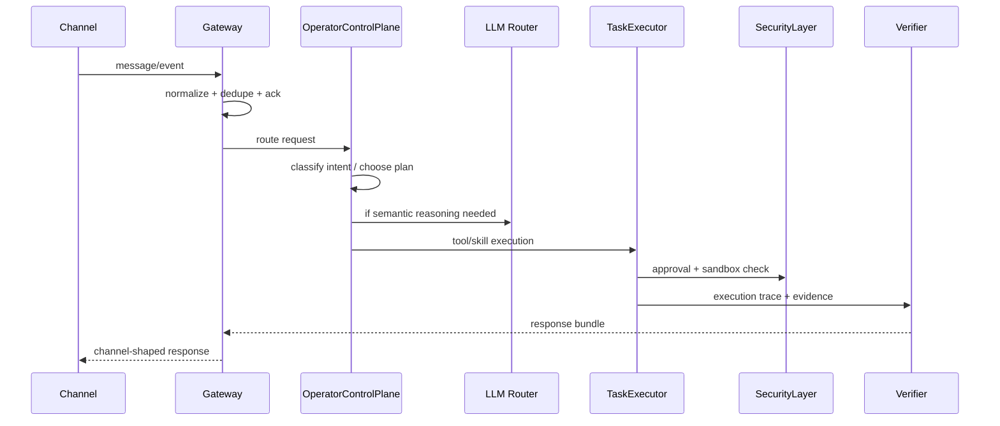
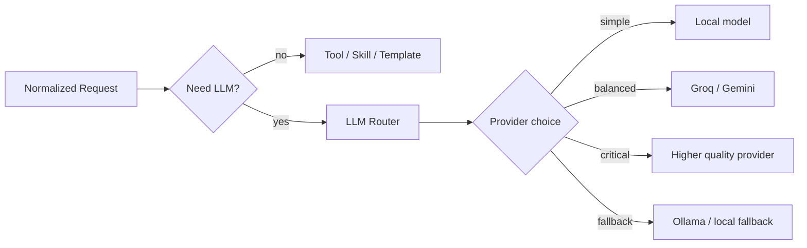

# CHANELLES.md

Bu dosya Elyan'ın kanal mimarisi, gateway akışı ve LLM bağlantısı için tek rehberdir.
Amaç: çok hızlı, düşük hata oranlı, kanal-bağımsız ve evidence-first çalışan bir operasyon hattı tanımlamak.

## 1. Temel İlke

Kural:

- Kanal adapter'ı karar vermez.
- LLM doğrudan kanaldan çağrılmaz.
- Tüm istekler önce normalize edilir, sonra Elyan çekirdeğine gider.
- Uzun işlerde kanal thread'i bloklanmaz.
- Riskli işlerde approval zorunludur.
- Çıktı her zaman kanalın formatına göre şekillendirilir.

Kısa model:

`Channel -> Adapter -> Normalizer -> Gateway -> Control Plane -> Tool/Skill/LLM -> Verifier -> Channel Response`

## 2. Sistem Şeması





## 3. Kanal Sınıfları

### 3.1 Messaging Kanalları

Bu kanallar kısa, net, eylem odaklı cevap ister:

- Telegram
- WhatsApp
- Signal
- Slack
- Discord
- Matrix
- Microsoft Teams
- iMessage / BlueBubbles
- Google Chat
- Web chat

Bu kanallarda hedef:

- hızlı ack
- kısa cevap
- gerektiğinde takip mesajı
- uzun trace'i ayrı yüzeyde verme

### 3.2 Control Kanalları

Bu yüzeyler daha yapılandırılmıştır:

- CLI
- Dashboard
- Gateway API
- WebSocket stream

Bu kanallarda hedef:

- detaylı durum
- trace
- evidence
- yapılandırma
- admin kontrol

### 3.3 Machine Channels

Webhook, integration event ve automation tetikleri bu gruba girer.
Burada cevaplar makine tarafından okunabilir olmalı.

## 4. Hızlı ve Sorunsuz Çalışma Algoritması

Bu algoritma Elyan'ın kanal performansını sabit tutmak için temel akıştır.

### 4.1 Giriş Algoritması

```text
1. Event al
2. Idempotency key üret
3. Duplicate kontrolü yap
4. Kanal tipini belirle
5. Girdi uzunluğunu ve riskini hesapla
6. Fast path mümkün mü kontrol et
7. Değilse control plane'e gönder
8. Gerekirse LLM veya tool planı üret
9. Approval gerekiyorsa onay iste
10. Sandbox'ta çalıştır
11. Verifier ile kanıt topla
12. Kanal formatına göre cevapla
13. Memory ve trace'i async kaydet
```

### 4.2 Pseudocode

```python
def handle_event(event):
    envelope = normalize(event)
    if seen(envelope.id):
        return ack_only()

    if quick_path_available(envelope):
        result = run_quick_path(envelope)
        return format_for_channel(envelope.channel, result)

    plan = operator_control_plane.route(envelope)
    if plan.requires_approval:
        approve_or_stop(plan)

    execution = task_executor.execute(plan)
    evidence = verifier.collect(execution)
    response = response_formatter.render(
        channel=envelope.channel,
        result=execution,
        evidence=evidence,
    )
    persist_async(envelope, plan, execution, evidence)
    return response
```

## 5. Routing Kararları

Elyan'ın routing kararı tek bir skorla verilmemeli; birkaç faktör birlikte değerlendirilmeli.

Önerilen ağırlık mantığı:

`route_score = intent_confidence * 0.35 + memory_match * 0.20 + tool_fit * 0.20 + context_fit * 0.15 - risk_penalty * 0.10`

Karar kuralları:

- skoru yüksek olan plan çalıştırılır
- skor orta ise netleştirme sorusu sorulur
- skor düşük veya risk yüksek ise beklenir veya onay istenir

### 5.1 Fast Path Koşulları

Fast path kullanılmalıysa:

- kısa ve net komut
- bilinen intent
- yerel araçla çözülebilir iş
- düşük risk
- düşük bağlam ihtiyacı

Fast path örnekleri:

- saat sorusu
- basit durum sorgusu
- kayıtlı tercih sorgusu
- tek adımlı dosya işlemi

### 5.2 Slow Path Koşulları

LLM veya çok adımlı plan gerekir:

- belirsiz komut
- çok adımlı iş
- araştırma gerektiren iş
- yeni skill seçimi
- entegrasyon veya kanal kararı
- riskli/destructive işlem

## 6. LLM Bağlantı Şeması

LLM yalnızca gerektiğinde devreye girmeli.
Kanal adapter'ı ile LLM arasında doğrudan bağlantı kurma.



### 6.1 Provider Seçim Kriteri

Seçim şu sırayla yapılmalı:

1. Yetkinlik yeterliyse local model
2. Düşük maliyetli provider
3. Düşük gecikmeli provider
4. Yüksek kalite provider
5. Son çare fallback

Seçim skoru örneği:

`provider_score = quality * 0.40 + latency_fit * 0.25 + cost_fit * 0.20 + availability * 0.15`

### 6.2 Prompt Kırpma ve Bağlam Yönetimi

Hız için:

- sadece gerekli memory'i ekle
- tekrar eden bağlamı sıkıştır
- kanal gürültüsünü çıkar
- uzun trace'i prompt'a değil evidence yüzeyine koy
- kısa komutlar için minimal prompt kullan

### 6.3 Streaming ve Parçalı Yanıt

Uzun cevaplarda:

- önce kısa ack gönder
- sonra ilerleme mesajı ver
- ardından nihai cevap ve evidence göster

Bu yaklaşım özellikle Telegram, WhatsApp ve web chat için gecikme hissini azaltır.

## 7. Kanal Bazlı Yanıt Politikası

### 7.1 Telegram / WhatsApp / Signal

Bu kanallar için:

- kısa cümle
- net aksiyon
- emoji kullanmadan sade yazım
- gerekiyorsa tek soru
- uzun trace yerine özet

### 7.2 Slack / Discord / Teams / Matrix

Bu kanallar için:

- kısa ama yapılandırılmış cevap
- madde madde sonuç
- gerektiğinde thread içinde takip
- evidence linki veya trace referansı

### 7.3 CLI

CLI için:

- teknik ve kısa
- mümkünse JSON uyumlu
- hata kodu açık
- komut ve çıktı net

### 7.4 Dashboard / Web

Dashboard için:

- zengin trace
- evidence gallery
- live state
- görev kartları
- approval kartları

### 7.5 Email

Email için:

- resmi dil
- konu + özet + aksiyonlar
- uzun bağlamı yapısal ver

## 8. Risk, Approval ve Sandbox

Destructive ya da geri dönüşü zor işler için:

- approval matrix zorunlu
- ekran onayı veya iki faktörlü onay gerektiğinde devreye girer
- sandbox dışına çıkma yok
- log'a secret yazma yok

Örnek risk sınıfları:

- düşük: read, search, status, inspect
- orta: navigate, draft, plan, preview
- yüksek: delete, send, publish, execute, purchase

Yüksek riskli işler için cevap formatı:

- ne yapılacak
- neden onay gerekiyor
- hangi etki doğacak
- nasıl geri alınır

## 9. Veri Kontratı

Kanal ile Elyan arasında taşıma yapılan standart yapı:

```json
{
  "channel": "telegram",
  "message_id": "123",
  "user_id": "u_001",
  "conversation_id": "c_001",
  "text": "Masaüstünde ne var?",
  "attachments": [],
  "metadata": {
    "timestamp": "2026-03-21T00:00:00Z",
    "locale": "tr-TR",
    "source": "telegram"
  }
}
```

Çıkış kontratı:

```json
{
  "success": true,
  "status": "success",
  "message": "Kısa cevap",
  "answer": "Asıl yanıt",
  "evidence": [],
  "trace_id": "trace_...",
  "next_action": null
}
```

## 10. Performans Bütçesi

Hedefler:

- ingress ack: mümkünse anında
- normalization: çok hızlı
- quick intent: milisaniye seviyesinde
- local tool path: kısa
- remote LLM path: sadece gerektiğinde
- evidence persist: asenkron

Performansı korumak için:

- adapter'ı ince tut
- gateway'de karar ver
- pahalı işleri kuyrukla
- cache kullan
- aynı mesajı iki kez işleme
- long-running işleri kanal thread'inde bloklama

## 11. Hata Toleransı

Failover sırası:

1. hızlı cache
2. yerel intent / memory
3. local tool
4. yerel LLM
5. düşük maliyetli remote provider
6. kalite provider
7. son çare fallback

Hata durumunda:

- adapter hata verirse gateway tekrar dener
- LLM düşerse diğer provider'a geçilir
- tool fail olursa minimal error döner
- sandbox fail olursa güvenli reddet
- approval reddedilirse işlemi durdur

## 12. Yeni Kanal Eklemek İçin Checklist

Bir kanal eklerken şu sırayı kullan:

1. Adapter yaz
2. Normalize et
3. Idempotency ekle
4. Gateway route ekle
5. Response formatter bağla
6. Approval ve security kurallarını uygula
7. Trace / evidence entegrasyonu yap
8. Channel-specific response style tanımla
9. Test ekle
10. Dokümantasyonu bu dosyada güncelle

## 13. Elyan'ı Hızlı ve Sorunsuz Tutma Rehberi

En kritik kurallar:

- Adapter'ı ince tut
- Gateway'i tek karar noktası yap
- LLM'yi sonradan seç
- Riskli işte approval iste
- Çıktıyı kanala uygun biçimde ver
- Uzun işleri background'a at
- Evidence olmadan tamamlandı deme
- Bir mesajı tekrar işleme
- Kayıt ve trace'i asenkron yaz

## 14. Kısa Özet

En iyi mimari şu fikre dayanır:

- kanal sadece giriş kapısıdır
- Elyan karar motorudur
- LLM sadece gerektiğinde yardımcıdır
- güvenlik ve sandbox son kapıdır
- verifier gerçeğin kanıtıdır
- response formatter kanalın son yüzüdür

Bu yapı doğru kurulduğunda Elyan hızlı, akıcı, güvenli ve ölçeklenebilir kalır.

## 15. Project Packs Yüzeyi

Project Packs ekranı da aynı prensiple çalışır:

- Tek bir `/api/packs` overview çağrısı ile kartlar beslenir.
- Kartlar `status`, `readiness`, `root`, `bundle`, `feature_count` ve kısa feature örneklerini gösterir.
- Kartlar `status`, `readiness`, `readiness_percent`, `missing_features`, `root`, `bundle`, `feature_count` ve kısa feature örneklerini gösterir.
- Önerilen komut ve diğer komutlar kopyalanabilir çipler halinde sunulur; kullanıcı scaffold veya workflow için tek tıkla komut alır.
- Per-card ayrık fetch yapma; gecikmeyi artırır ve dashboard'u kirletir.
- Trace bağlantısı varsa gerçek mission trace kullanılır; sahte trace linki üretilmez.

Algoritma:

1. Pack overview al
2. Live status'u normalize et
3. Readiness ve feature sayısını türet
4. Komut rail'ini oluştur
5. Kartı render et
6. Kullanıcı isterse mission başlat veya komut kopyala

Bu yüzeyin amacı demo sırasında "hangi pack hazır, ne eksik, sonraki adım ne?" sorusuna tek ekranda cevap vermektir.
