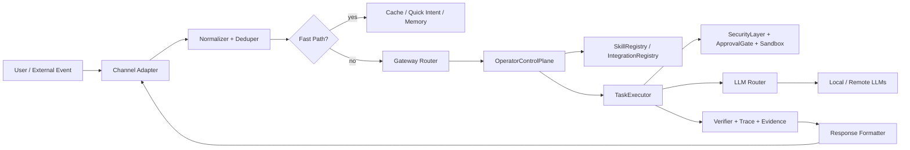
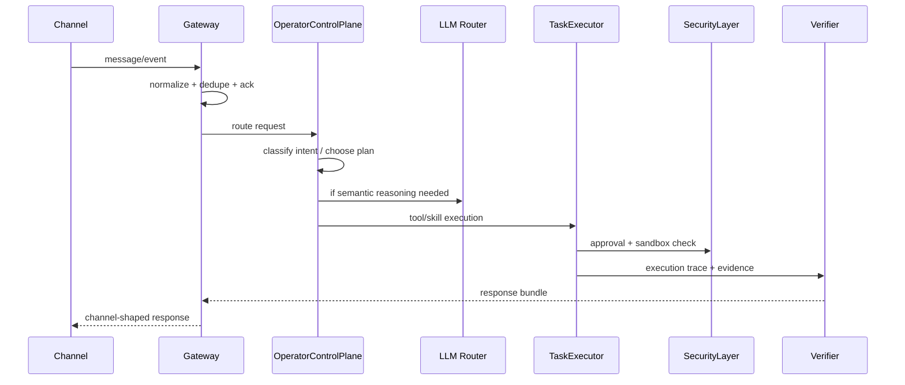
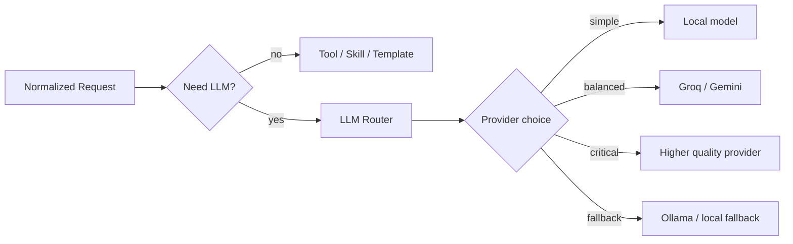

# CHANNELS.md

This file is the single guide for Elyan's channel architecture, gateway flow, and LLM connectivity.
Purpose: to define an extremely fast, low-error, channel-independent, and evidence-first operational pipeline.

## 1. Core Principle

Rule:

- The channel adapter does not make decisions.
- The LLM is not called directly from the channel.
- All requests are first normalized, then sent to the Elyan core.
- The channel thread is never blocked for long-running workflows.
- Approval is mandatory for risky actions.
- The output is always shaped according to the channel’s format.

Short model:

`Channel -> Adapter -> Normalizer -> Gateway -> Control Plane -> Tool/Skill/LLM -> Verifier -> Channel Response`

## 2. System Diagram





## 3. Channel Classes

### 3.1 Messaging Channels

These channels require short, clear, action-oriented responses:

- Telegram
- WhatsApp
- Signal
- Slack
- Discord
- Matrix
- Microsoft Teams
- iMessage / BlueBubbles
- Google Chat
- Web chat

Goals in these channels:

- fast ack
- short response
- follow-up message when necessary
- provide long traces in a separate surface

### 3.2 Control Channels

These surfaces are more structured:

- CLI
- Dashboard
- Gateway API
- WebSocket stream

Goals in these channels:

- detailed status
- execution trace
- evidence
- configuration
- admin control

### 3.3 Machine Channels

Webhooks, integration events, and automation triggers fall into this group.
Responses here must be machine-readable.

## 4. Fast & Frictionless Execution Algorithm

This algorithm is the core flow to keep Elyan's channel performance stable.

### 4.1 Ingress Algorithm

```text
1. Receive event
2. Generate idempotency key
3. Perform duplicate check
4. Determine channel type
5. Calculate input length and risk
6. Check if fast path is possible
7. If not, route to control plane
8. Generate LLM or tool plan if needed
9. Request approval if mandatory
10. Execute in sandbox
11. Collect evidence via Verifier
12. Format response based on channel
13. Persist memory and trace asynchronously
```

### 4.2 Pseudocode

```python
def handle_event(event):
    envelope = normalize(event)
    if seen(envelope.id):
        return ack_only()

    if quick_path_available(envelope):
        result = run_quick_path(envelope)
        return format_for_channel(envelope.channel, result)

    plan = operator_control_plane.route(envelope)
    if plan.requires_approval:
        approve_or_stop(plan)

    execution = task_executor.execute(plan)
    evidence = verifier.collect(execution)
    response = response_formatter.render(
        channel=envelope.channel,
        result=execution,
        evidence=evidence,
    )
    persist_async(envelope, plan, execution, evidence)
    return response
```

## 5. Routing Decisions

Elyan’s routing decision should not be based on a single score; several factors must be evaluated together.

Suggested weight logic:

`route_score = intent_confidence * 0.35 + memory_match * 0.20 + tool_fit * 0.20 + context_fit * 0.15 - risk_penalty * 0.10`

Decision rules:

- high score -> execute plan
- medium score -> ask clarifying question
- low score or high risk -> wait or request approval

### 5.1 Fast Path Conditions

Fast path should be used if:

- short and clear command
- known intent
- task solvable via local tool
- low risk
- low context requirement

Fast path examples:

- asking for the time
- simple status query
- querying saved preferences
- single-step file operation

### 5.2 Slow Path Conditions

LLM or multi-step plan is required if:

- ambiguous command
- multi-step task
- task requiring research
- selecting a new skill
- integration or channel decision
- risky/destructive operation

## 6. LLM Connectivity Architecture

The LLM should only intervene when absolutely necessary.
Do not establish a direct connection between the channel adapter and the LLM.



### 6.1 Provider Selection Criteria

Selection should be prioritized in this order:

1. Local model if competency is sufficient
2. Low-cost provider
3. Low-latency provider
4. High-quality provider
5. Last-resort fallback

Example selection score:

`provider_score = quality * 0.40 + latency_fit * 0.25 + cost_fit * 0.20 + availability * 0.15`

### 6.2 Prompt Trimming and Context Management

For speed:

- only inject necessary memory
- compress repetitive context
- filter out channel noise
- place long traces in the evidence surface, not in the prompt
- use minimal prompts for short commands

### 6.3 Streaming and Chunked Responses

For long responses:

- send a short ack first
- provide a progress message next
- deliver the final response and evidence later

This approach drastically reduces perceived latency, especially for Telegram, WhatsApp, and web chat.

## 7. Channel-Based Response Policy

### 7.1 Telegram / WhatsApp / Signal

For these channels:

- short sentences
- clear actionable points
- plain text without excessive emojis
- a single question if necessary
- provide summaries instead of long traces

### 7.2 Slack / Discord / Teams / Matrix

For these channels:

- short but structured responses
- bulleted results
- threads for follow-ups when needed
- evidence links or trace references

### 7.3 CLI

For the CLI:

- technical and concise
- JSON compatible when possible
- explicit error codes
- clear command and output separation

### 7.4 Dashboard / Web

For the Dashboard:

- rich traces
- evidence galleries
- live state streaming
- task cards
- approval cards

### 7.5 Email

For Email:

- formal tone
- subject + summary + action items
- provide long context in a structured format

## 8. Risk, Approval, and Sandbox

For destructive or difficult-to-reverse tasks:

- approval matrix is mandatory
- screen approval or true 2FA triggers when necessary
- no breaking out of the sandbox
- no leaking secrets into logs

Example risk classes:

- low: read, search, status, inspect
- medium: navigate, draft, plan, preview
- high: delete, send, publish, execute, purchase

Response format for high-risk jobs:

- what will be done
- why approval is required
- what the impact will be
- how to undo the action

## 9. Data Contract

The standard payload struct between the channel and Elyan:

```json
{
  "channel": "telegram",
  "message_id": "123",
  "user_id": "u_001",
  "conversation_id": "c_001",
  "text": "What is on the desktop?",
  "attachments": [],
  "metadata": {
    "timestamp": "2026-03-21T00:00:00Z",
    "locale": "en-US",
    "source": "telegram"
  }
}
```

Output contract:

```json
{
  "success": true,
  "status": "success",
  "message": "Short summary",
  "answer": "Primary response",
  "evidence": [],
  "trace_id": "trace_...",
  "next_action": null
}
```

## 10. Performance Budget

Targets:

- ingress ack: instant if possible
- normalization: extremely fast
- quick intent: millisecond range
- local tool path: short
- remote LLM path: only when necessary
- evidence persist: asynchronous

To maintain performance:

- keep adapters thin
- make decisions at the gateway
- queue expensive tasks
- use caches
- never process the same message twice
- never block the channel thread with long-running tasks

## 11. Fault Tolerance

Failover sequence:

1. fast cache
2. local intent / memory
3. local tool
4. local LLM
5. low-cost remote provider
6. high-quality provider
7. last-resort fallback

In case of failure:

- if the adapter fails, the gateway retries
- if the LLM drops, switch to another provider
- if a tool fails, return a minimal error
- if a sandbox check fails, reject safely
- if approval is denied, halt execution

## 12. Checklist for Adding a New Channel

Use this sequence when adding a new channel:

1. Write the Adapter
2. Normalize inputs
3. Implement Idempotency
4. Add the Gateway route
5. Connect the Response Formatter
6. Apply Approval and Security rules
7. Integrate Trace / Evidence logic
8. Define Channel-specific response styles
9. Add tests
10. Update the documentation in this file

## 13. Guide to Keeping Elyan Fast and Seamless

The most critical rules:

- Keep the Adapter thin
- Make the Gateway the single decision point
- Keep the LLM as a fallback choice
- Always request approval for risky operations
- Serve output appropriately shaped for the channel
- Push long-running tasks to the background
- Never claim completion without Evidence
- Do not process a message twice
- Persist logs and traces asynchronously

## 14. Brief Summary

The best architecture relies on this mindset:

- the channel is merely the front door
- Elyan is the decision engine
- the LLM is just a helper when necessary
- safety and sandboxing are the final gates
- the verifier is the proof of reality
- the response formatter is the final face to the channel

When constructed this way, Elyan remains fast, fluid, secure, and scalable.

## 15. Project Packs Surface

The Project Packs screen follows the same principles:

- Driven by a single `/api/packs` overview call.
- Cards show `status`, `readiness`, `readiness_percent`, `missing_features`, `root`, `bundle`, `feature_count` and feature snippets.
- Suggested commands and alternatives are displayed as copyable chips; giving users a 1-click scaffold or workflow command.
- Do not execute distinct per-card fetches; doing so increases latency and pollutes the dashboard.
- If an execution trace exists, the real mission trace is linked; never generate fake trace metrics.

Algorithm:

1. Fetch Pack overview
2. Normalize live status
3. Derive readiness and feature volume
4. Build the command rails
5. Render the card
6. Start mission or copy command upon user interaction

The purpose of this surface is to instantly answer: "Which pack is ready, what is missing, and what is the next step?" in a single unified view during demonstrations.
