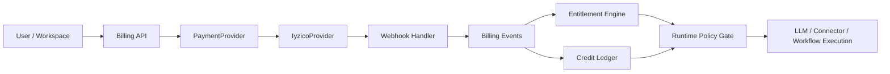
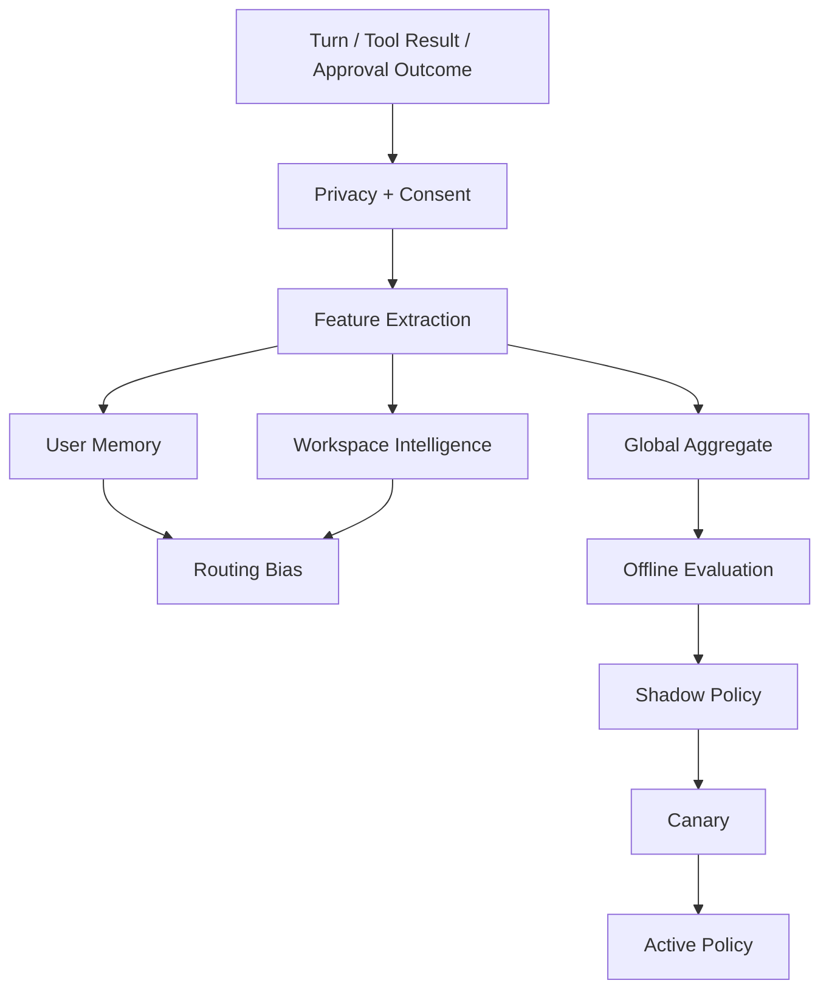

# Elyan — Local-First Operator Runtime and Commercial Control Plane

Elyan bir chatbot degil; local-first calisan, onay-gated side effect yurutebilen, workspace tabanli operator runtime'dir. Nisan 2026 itibariyla urun dogrultusu su eksende sabitlendi:

- workspace-first commercial ownership
- Iyzico-first payment abstraction
- Elyan Credits tabanli usage accounting
- hosted/admin control plane + local runtime ayrimi
- user/workspace/global learning fabric
- immutable billing, audit ve replayable event zinciri

## Current Status

Aktif implementasyon commercialization execution plan uzerinden ilerliyor. Ilk uygulanmis temel katmanlar:

- `core/billing/workspace_billing.py` provider-agnostic workspace billing truth'una tasindi.
- `core/billing/commercial_types.py`, `core/billing/payment_provider.py`, `core/billing/iyzico_provider.py` ile canonical plan, token pack ve payment provider kontratlari eklendi.
- `core/persistence/runtime_db.py` icine `billing_events`, `credit_ledger`, `entitlement_snapshots`, `workspace_invites` ve membership/RBAC repository zemini eklendi.
- `core/gateway/server.py` login-time first user bootstrap'tan cikti; explicit owner bootstrap ve CSRF enforcement geldi.

## Commercial Runtime Direction

### Commerce Plane
- Kullaniciya ham provider token satilmaz; urun dili `Elyan Credits` olur.
- Planlar: `free`, `pro`, `team`, `enterprise`
- Top-up modeli: token pack purchase
- Truth zinciri: `billing_events -> entitlement_snapshots -> credit_ledger`

### Control Plane
- Desktop canonical operator shell olarak kalir.
- Hosted/admin plane workspace, billing, memberships, approvals, connector health ve learning policy yuzeylerini tasir.
- Local ops console sadece breakglass/debug yuzeyi olur.

### Learning Fabric
- `user memory`
- `workspace intelligence`
- `global aggregate intelligence`

Bu katmanlar privacy + consent gate, reward scoring, offline eval ve staged promotion ile birbirine baglanir.

## Current Phase Map

- Phase 0: documentation baseline aktif
- Phase 1: canonical commercial domain foundation uygulandi
- Phase 2: Iyzico provider abstraction foundation uygulandi
- Phase 3: workspace membership/RBAC ve explicit owner bootstrap temeli uygulandi
- Phase 7: gateway CSRF enforcement ilk dilimde uygulandi

## Key Docs

- [ROADMAP.md](./ROADMAP.md)
- [PROGRESS.md](./PROGRESS.md)
- [memory.md](./memory.md)
- [docs/ELYAN_V2_ARCHITECTURE.md](./docs/ELYAN_V2_ARCHITECTURE.md)
- [docs/BILLING_IYZICO_ARCHITECTURE.md](./docs/BILLING_IYZICO_ARCHITECTURE.md)
- [docs/ADMIN_CONTROL_PLANE.md](./docs/ADMIN_CONTROL_PLANE.md)
- [docs/LEARNING_FABRIC.md](./docs/LEARNING_FABRIC.md)
- [docs/COMMERCIAL_EVENTS_AND_LEDGER.md](./docs/COMMERCIAL_EVENTS_AND_LEDGER.md)

## Commercial Flow

## Learning Flow

