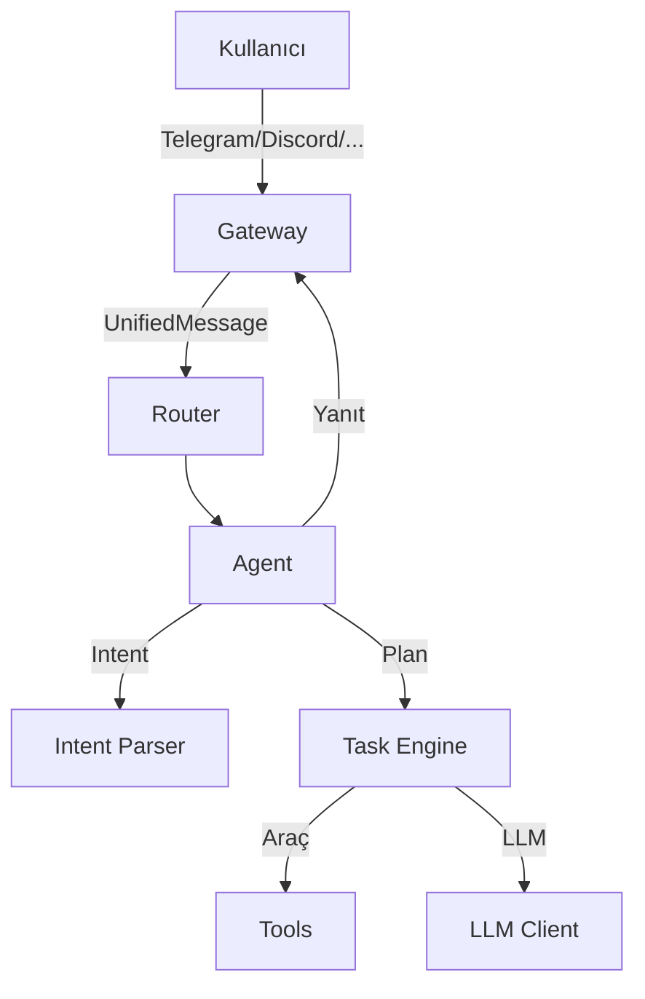

# Elyan — Özerk AI Operatör

**Elyan bir sohbet botu değildir. Elyan = bilgisayarda çalışan, teslimat odaklı dijital operatör.**

```
Goal → Contract → Plan → Execute → Verify → Deliver → Learn
```

## Hızlı Başlangıç

=== "macOS / Linux"

    ```bash
    # Tek komutlu kurulum
    bash install.sh

    # Veya manuel
    python3 -m venv .venv && source .venv/bin/activate
    pip install -e .
    elyan onboard
    ```

=== "Docker"

    ```bash
    docker pull ghcr.io/your-org/elyan:latest
    docker run -d \
      -p 18789:18789 \
      -e TELEGRAM_BOT_TOKEN=your_token \
      -e GROQ_API_KEY=your_key \
      -v ~/.elyan:/home/elyan/.elyan \
      ghcr.io/your-org/elyan:latest
    ```

=== "Kubernetes (Helm)"

    ```bash
    helm install elyan ./helm/elyan \
      --set secrets.data.TELEGRAM_BOT_TOKEN=your_token \
      --set secrets.data.GROQ_API_KEY=your_key
    ```

## Özellikler

| Özellik | Durum |
|---------|-------|
| Telegram entegrasyonu | ✅ Aktif |
| Discord entegrasyonu | ✅ Aktif |
| Slack entegrasyonu | ✅ Aktif |
| Signal entegrasyonu | 🔧 Beta |
| Matrix/Element | 🔧 Beta |
| Microsoft Teams | 🔧 Beta |
| Google Chat | 🔧 Beta |
| Web Dashboard | ✅ Aktif |
| Cron Görevleri | ✅ Aktif |
| Tarayıcı Otomasyonu | ✅ Aktif |
| Ses Komutları | ✅ Aktif |
| Docker / Kubernetes | ✅ Aktif |

## Mimari



## Lisans

MIT License — [GitHub](https://github.com/your-org/elyan)
